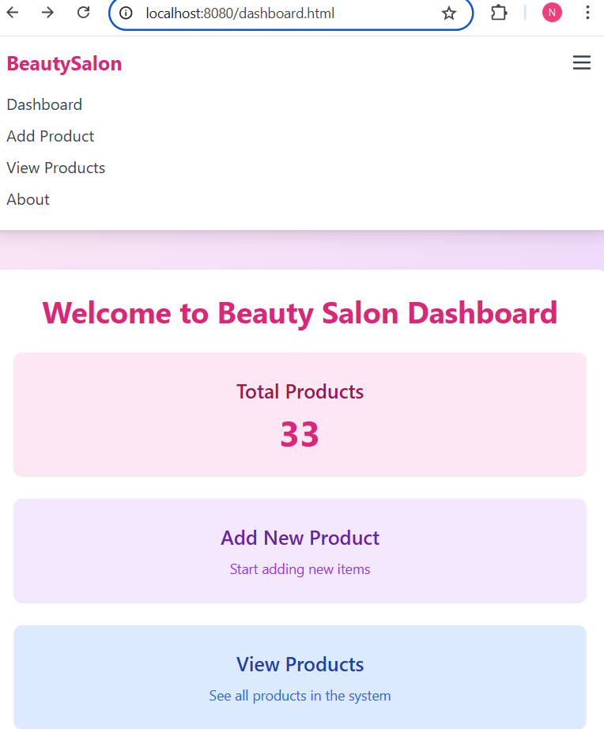
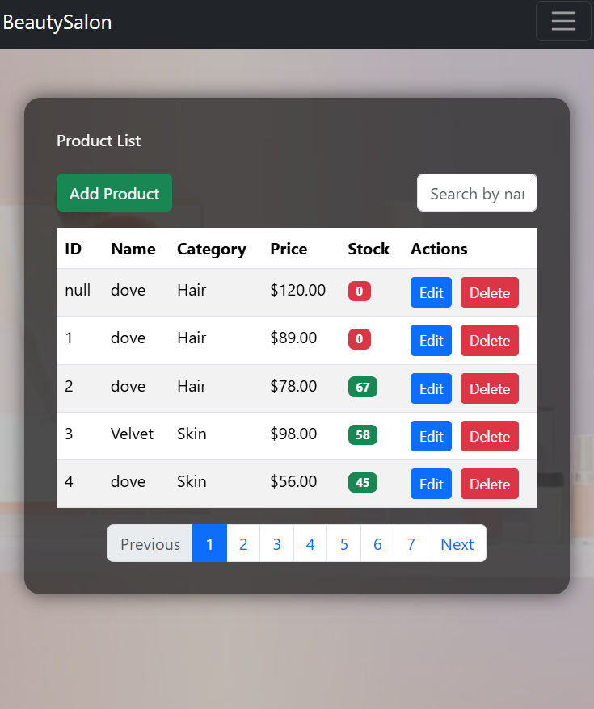
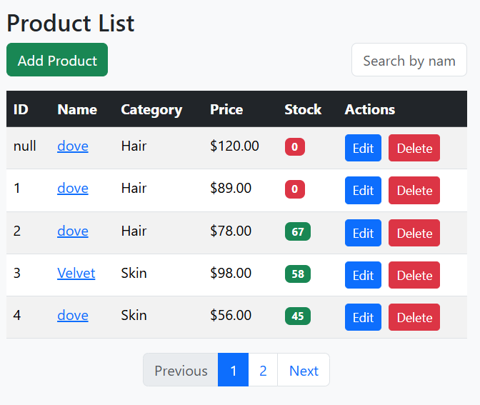
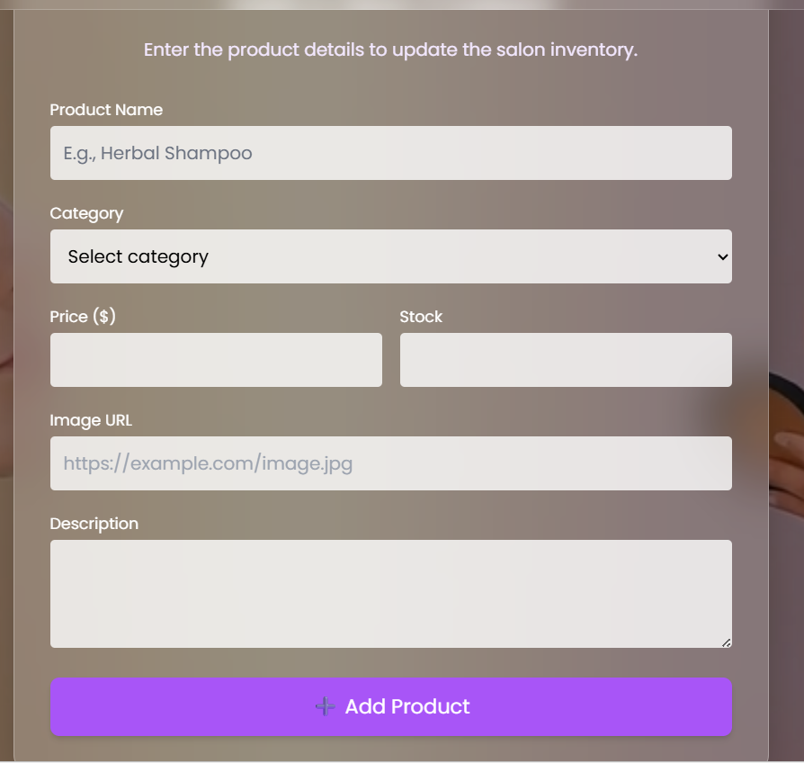
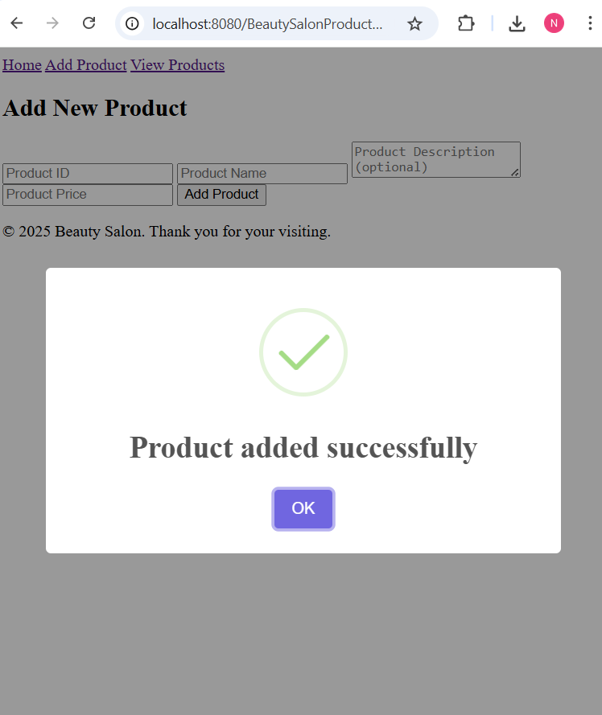
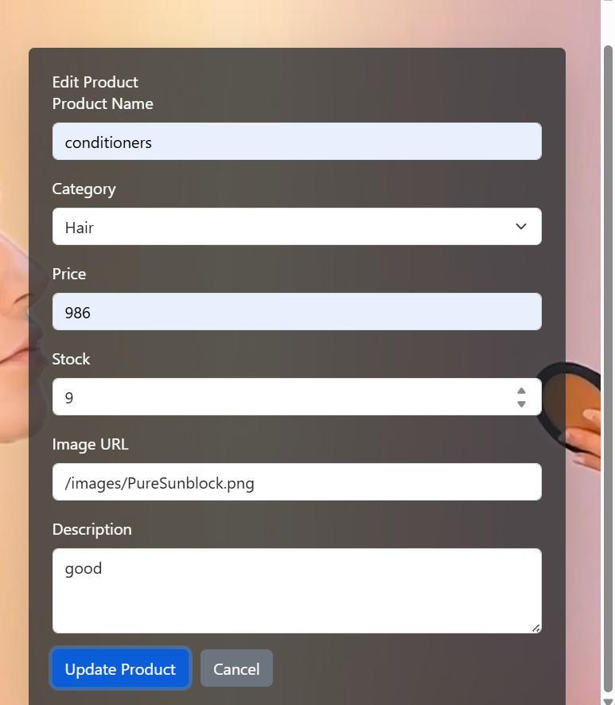
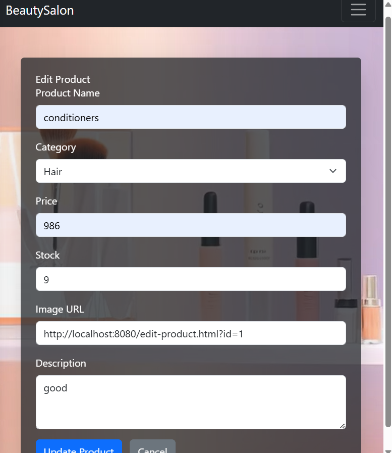

<h1 align="center">💄 Beauty Salon Product Management System</h1>

<p align="center">
  <b>Full-Stack Web Application for Managing Salon Products Efficiently</b><br>
  <i>Built with Spring Boot • HTML • CSS • JavaScript</i>
</p>

<p align="center">
  
  
  
  
</p>

---

## 🚀 Overview

The **Beauty Salon Product Management System** is a modern full-stack application designed to manage salon inventory with a clean UI and powerful backend.

This system provides a complete solution for managing products with real-time updates and intuitive design.

---

## ✨ Features

* ➕ Add new products
* 📋 View all products with pagination
* 🔍 Search products by name
* ✏️ Edit product details
* ❌ Delete products
* 📊 Dashboard with total product count
* 🎨 Modern responsive UI

---

## 🧠 Architecture

```
Frontend (HTML, CSS, JS)
        ↓
REST API (Spring Boot)
        ↓
Data Storage (JSON File)
```

---

## 🛠️ Tech Stack

| Category     | Technology            |
| ------------ | --------------------- |
| Backend      | Spring Boot (Java)    |
| Frontend     | HTML, CSS, JavaScript |
| Data Storage | JSON                  |
| Build Tool   | Maven                 |

---

## 📸 Screenshots

### 📊 Dashboard



### 📋 Product List




### ➕ Add Product

<p align="center">
  
  
</p>

<p align="center">
  <b>Add Product Form</b>
  &nbsp;&nbsp;&nbsp;&nbsp;&nbsp;&nbsp;&nbsp;&nbsp;&nbsp;&nbsp;
  <b>Success Message</b>
</p>

### ✏️ Edit Product




---

## 📂 Project Structure

```
BeautySalon_ProductManagement/
│
├── src/main/java/com/example/demo/
│   ├── controller/
│   ├── service/
│   ├── repository/
│   ├── model/
│
├── src/main/resources/
│   ├── static/
│   └── application.properties
│
├── data/products.json
├── pom.xml
└── README.md
```

---

## ⚙️ Setup & Installation

### 🔧 Prerequisites

* Java JDK 17+
* Maven
* IDE (VS Code / IntelliJ)

---

### 🚀 Run the Project

```bash
git clone https://github.com/your-username/BeautySalon_ProductManagement.git
cd BeautySalon_ProductManagement
mvn spring-boot:run
```

---

### 🌐 Access the Application

```
http://localhost:8080/home.html
```

---

## 🔌 API Endpoints

| Method | Endpoint       | Description      |
| ------ | -------------- | ---------------- |
| GET    | /products      | Get all products |
| POST   | /products      | Add product      |
| PUT    | /products/{id} | Update product   |
| DELETE | /products/{id} | Delete product   |

---

## 🧪 Sample Data

```json
{
  "id": 1,
  "name": "Hair Serum",
  "category": "Hair",
  "price": 1200,
  "quantity": 10
}
```

---

## 🚧 Limitations

* Uses JSON instead of database
* No authentication system
* Not production-ready

---

## 🚀 Future Improvements

* 🔐 Authentication (JWT)
* 🗄️ Database (MongoDB / MySQL)
* 📊 Advanced dashboard
* 🖼️ Image upload
* 🌍 Deployment (Render / Railway)

---

## 👩‍💻 Author

**Mathuppriya Naguleswaran**
🎓 Software Engineering Undergraduate

---

## ⭐ Show Your Support

If you like this project:

⭐ Star this repo
🍴 Fork it
📢 Share it

---

<p align="center">
  💡 Built with passion to learn real-world software development 💡
</p>

